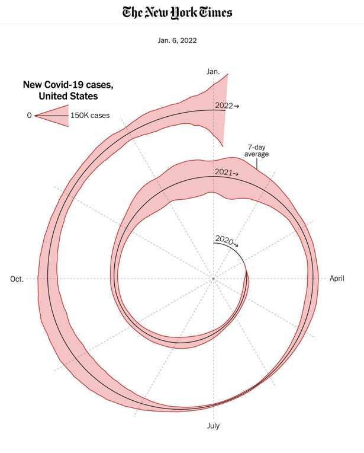
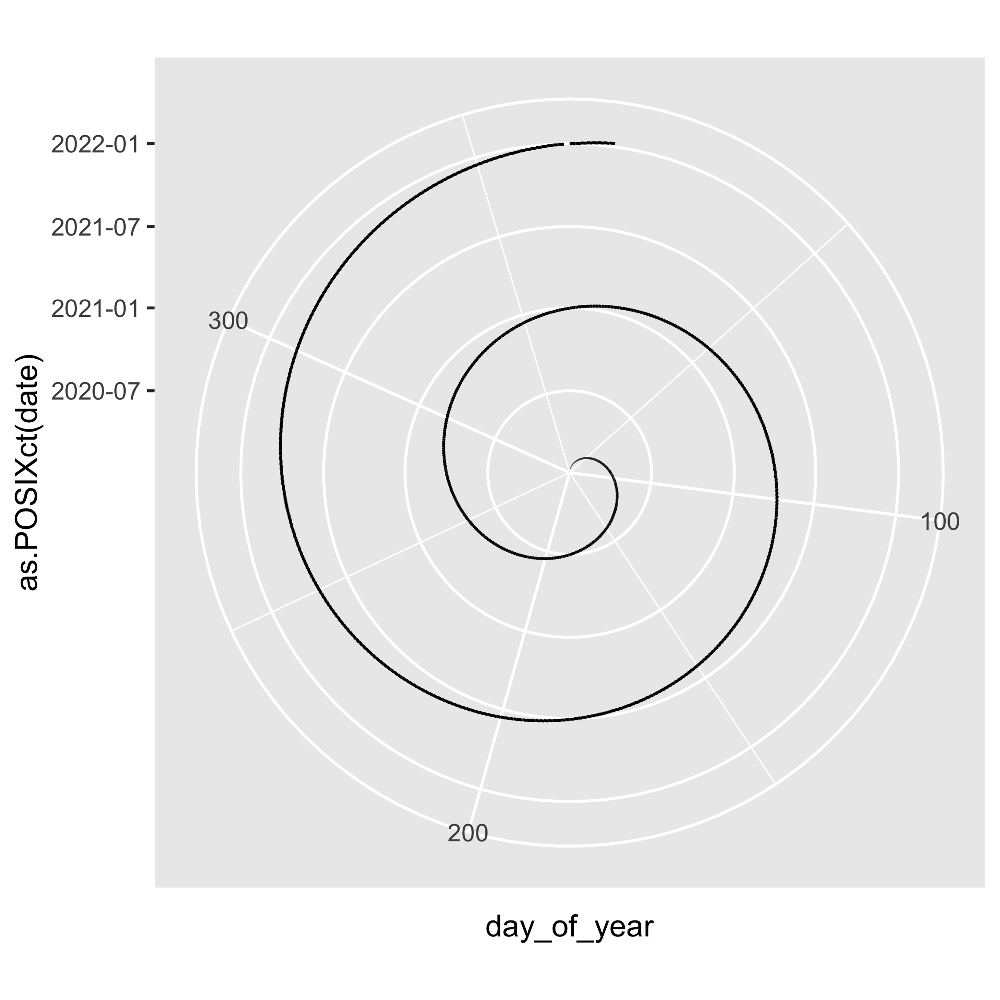
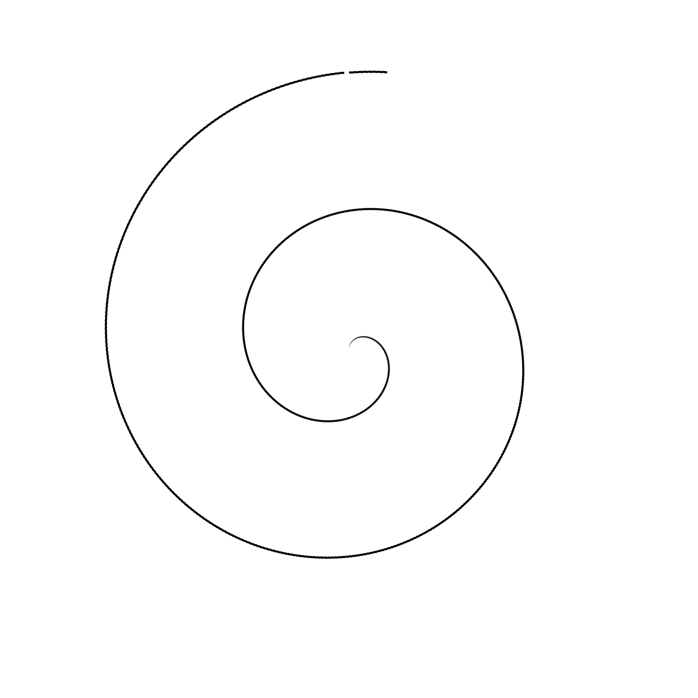
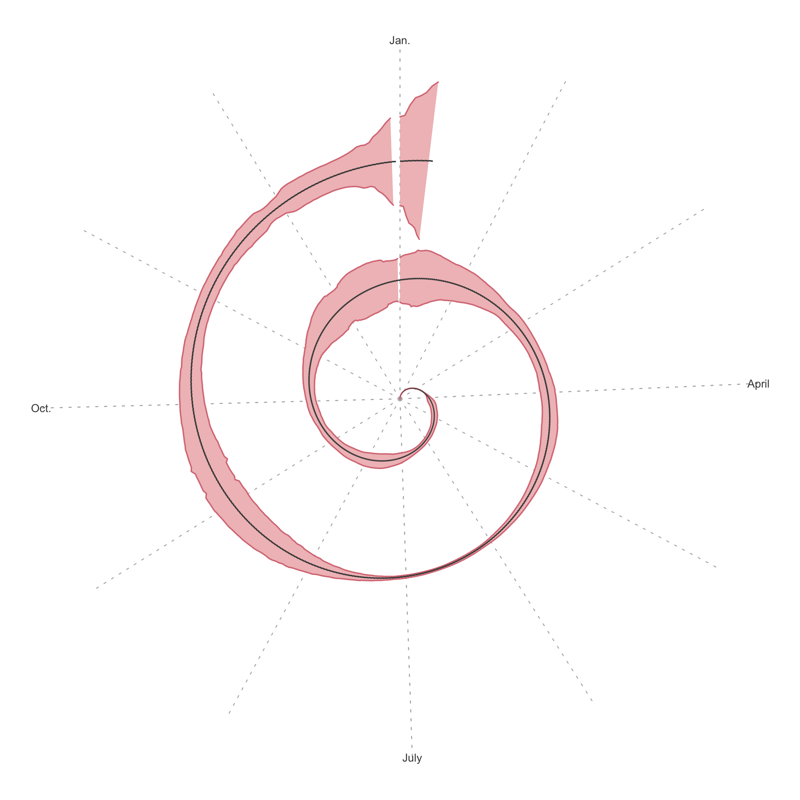
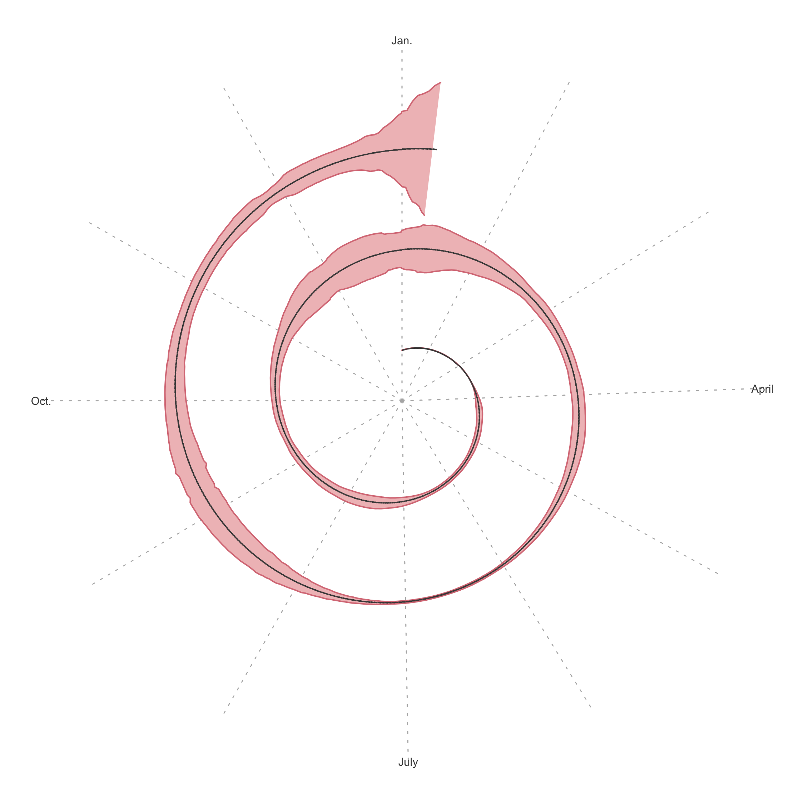
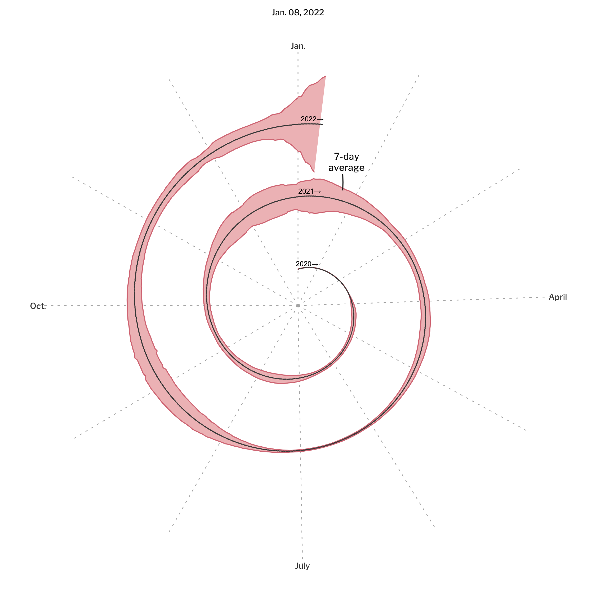
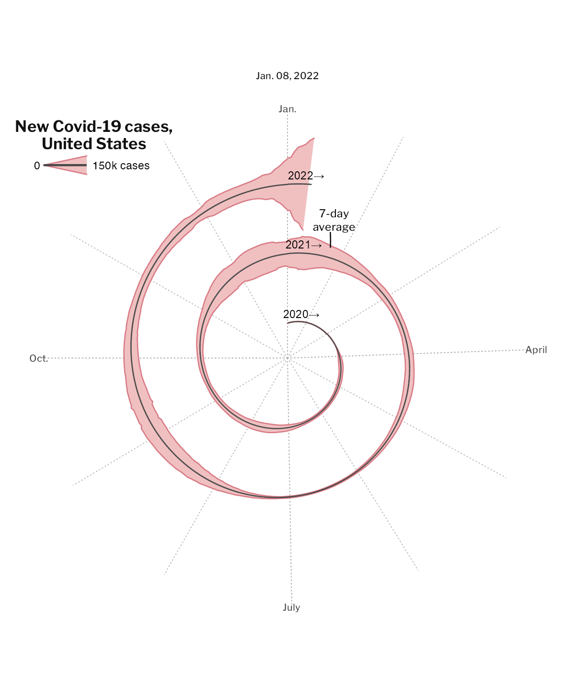

Recreating the New York Times COVID-19 Spiral Graph
================

In a recent [opinion
piece](https://www.nytimes.com/2022/01/06/opinion/omicron-covid-us.html)
the New York Times included this spiral graph showing the development of
confirmed COVID-19 cases in the United States since the beginning of the
pandemic. This visualization has stirred some debate whether it is “the
proper way” to display such data. Arguments have been exchanged why this
visualization is particularly bad or why it might actually be well
suitable for this use case.



## Recreating the Spiral

I will let everyone have their opinion, however, I challenged myself to
recreate this plot using R and especially the [ggplot2
package](https://ggplot2.tidyverse.org/). *(Hint: I like it.)*

### Packages

Let’s start with loading the R packages we will use for creating this
plot.

``` r
pacman::p_load("tidyverse", "ggtext", "here", "lubridate")
```

### Load and Prepare the Data

We use the COVID-19 Dataset by [Our World in
Data](https://github.com/owid/covid-19-data) for the number of confirmed
Coronavirus cases in the United States.

Since the original chart starts on January 1st, 2020, while the first
cases in the U.S. had been registered by end of January 2020, we add all
the days from January 1st to the first date in the data. We manage this
using `tibble::add_row` and `tidyr::complete`. (We could also insert all
missing dates manually, but maybe we want to reproduce the chart for
other countries?)

We calculate the day of the year as well as the year from the date
variable. The day of the year will be our x values in the plot. We will
use the year to group the data in order to display the information in a
cyclic manner.

``` r
owid_url <- "https://github.com/owid/covid-19-data/blob/master/public/data/owid-covid-data.csv?raw=true"
country <- "United States"
covid <- read_csv(owid_url)
covid_cases <- covid %>% 
  filter(location == country) %>% 
  select(date, new_cases, new_cases_smoothed) %>% 
  arrange(date) %>% 
  # Add the dates before the 1st confirmed case
  add_row(date = as_date("2020-01-01"), new_cases = 0, new_cases_smoothed = 0,
          .before = 1) %>% 
  complete(date = seq(min(.$date), max(.$date), by = 1),
           fill = list(new_cases = 0, new_cases_smoothed = 0)) %>% 
  mutate(day_of_year = yday(date),
         year = year(date)
         )
```

### A very basic plot

Since we want to display the data in a cyclic manner, we using a polar
coordinate system with `coord_polar`. The line is built from connecting
each day via `geom_segment`, which takes values for x (current day) and
xend (next day)and y and yend - the latter ones will be set to an
integer value (UNIX timestamp) with the function `as.POSIXct`.

``` r
p <- covid_cases %>% 
  ggplot() +
  geom_segment(aes(x = day_of_year, xend = day_of_year + 1, 
                   y = as.POSIXct(date), yend = as.POSIXct(date))) +
  coord_polar()
  p
```



We apply `theme_void` to get rid of any theme element.

``` r
p + theme_void()
```



### Here comes the Worm

Once we have the basic spiral, we want to encode the number of confirmed
COVID-19 cases with the size of the line. For this purpose we use the
`geom_ribbon` geom. For each x value, `geom_ribbon` displays a y
interval defined by ymin and ymax.

But which values to use? For `x`, we use the `day_of_the_year` column.
The `ymin` and `ymax` aesthetics are calculated from the UNIX timestamp
and the number of confirmed COVID-19 cases. For `ymin`, we *subtract*
the half of the number of cases, for `ymax`, we *add* same half of the
number of cases. Since the y values are pretty high in this plot
(seconds of the year), we multiply the number of cases with a certain
factor to make the ribbon visible. I have chosen 60 as a good factor.

We also add colors for the area and the outline.

``` r
size_factor <- 60

# Colors
outline_color <- "#D97C86"
fill_color <- "#F0C0C1"
base_grey <- "grey28"

p <- covid_cases %>% 
  ggplot() +
  # area to encode the number of cases
  geom_ribbon(aes(x = day_of_year, 
                  ymin = as.POSIXct(date) - new_cases_smoothed / 2 * size_factor,
                  ymax = as.POSIXct(date) + new_cases_smoothed / 2 * size_factor,
                  group = year),
              size = 0.3, col = outline_color, fill = fill_color, show.legend = FALSE) +
  # basic line
  geom_segment(aes(x = day_of_year, xend = day_of_year + 1, 
                   y = as.POSIXct(date), yend = as.POSIXct(date)),
               col = base_grey, size = 0.3) +
  coord_polar() +
  theme_void()
p
```


And voilà, here comes the worm.

### Grid lines

In order to plot the grid lines, we need month breaks. We can calculate
the breaks from the length of the months.

``` r
month_length <- c(31, 28, 31, 30, 31, 30,
                  31, 31, 30, 31, 30, 31)

month_breaks <- cumsum(month_length) - 30
```

To apply the grid, we use `scale_x_continuous` and add some theme
elements. We use quarters of the year as major breaks and and months as
minor breaks. We label the major grid lines. (The built-in vector
`month.abb` contains abbreviations of month names, but we customize the
month labels so that they are in line with the NYT chart.)

``` r
p + scale_x_continuous(minor_breaks = month_breaks, 
                     breaks = month_breaks[c(1, 4, 7, 10)],
                     labels = c("Jan.", "April", "July", "Oct.")) +
  theme(
    plot.background = element_rect(color = NA, fill = "white"),
    panel.grid.major.x = element_line(color = "grey70", size = 0.2, linetype = "dotted"),
    panel.grid.minor.x = element_line(color = "grey70", size = 0.2, linetype = "dotted"),
    axis.text.x = element_text(color = base_grey, size = 5, hjust = 0.5),
  )
```



Notice the small breaks in the spiral with every new year? Two things
are happening here: First, the scale is expanded slightly, we will
disable this `ggplot2` default behavior. But secondly and more
importantly, *2020 was a leap year*.

I am wondering how the team at New York Times handled it. My
quick-and-dirty workaround: drop February 29th, 2020. Given that we
present rolling 7-day averages this seems acceptable.

In the original plot, the spiral does not start in the center. We will
add some buffer to the limits of the polar y-axis.

``` r
p <- covid_cases %>% 
  # 2020 is a leap year, we could drop Feb 29, 2020 for the sake of 365-day years
  filter(date != as_date("2020-02-29")) %>%
  group_by(year) %>%
  mutate(day_of_year = row_number()) %>%
  ungroup() %>%
  ggplot() +
  # area
  geom_ribbon(aes(x = day_of_year, 
                  ymin = as.POSIXct(date) - new_cases_smoothed / 2 * size_factor,
                  ymax = as.POSIXct(date) + new_cases_smoothed / 2 * size_factor,
                  group = year),
              color = outline_color, size = 0.3, fill = fill_color, show.legend = FALSE) +
  # basic line
  geom_segment(aes(x = day_of_year, xend = day_of_year + 1, 
                   y = as.POSIXct(date), yend = as.POSIXct(date)),
               col = base_grey, size = 0.3) +
  scale_x_continuous(minor_breaks = month_breaks, 
                     breaks = month_breaks[c(1, 4, 7, 10)],
                     labels = c("Jan.", "April", "July", "Oct."),
                     limits = c(1, 365),
                     expand = c(0, 0)
                     ) +
  #' set the lower limit of the y-axis to a date before 2020 
  #' so that the spiral does not start in the center point
  scale_y_continuous(limits = c(as.POSIXct("2019-07-01"), NA),
                     expand = c(0, 0)) +
  coord_polar() +
  theme_void() +
  theme(
    plot.background = element_rect(color = NA, fill = "white"),
    panel.grid.major.x = element_line(color = "grey70", size = 0.2, linetype = "dotted"),
    panel.grid.minor.x = element_line(color = "grey70", size = 0.2, linetype = "dotted"),
    axis.text.x = element_text(color = base_grey, size = 5, hjust = 0.5)
  )
p
```



### Annotations

The original chart contains a couple of annotations: the years are
labelled in the spiral as a clue of the direction to read the plot, the
date of the latest data in the title, and the description that 7-day
averages are shown.

``` r
text_color <- rgb(18, 18, 18, maxColorValue = 255)
base_family <- "Libre Franklin Medium"
# base_family <- "Helvetica"
subtitle_date <- max(covid_cases$date) %>% 
  format("%b. %d, %Y")

# Annotations for the years in a list (used in annotate())
year_annotations <- list(
  year = 2020:2022,
  x = rep(3, 3),
  y = as.POSIXct(paste(2020:2022, "01", "01", sep = "-"))
)

p <- covid_cases %>% 
  # 2020 is a leap year, we could drop Feb 29, 2020 for the sake of 365-day years
  filter(date != as_date("2020-02-29")) %>%
  group_by(year) %>%
  mutate(day_of_year = row_number()) %>%
  ungroup() %>%
  ggplot() +
  # area
  geom_ribbon(aes(x = day_of_year, 
                  ymin = as.POSIXct(date) - new_cases_smoothed / 2 * size_factor,
                  ymax = as.POSIXct(date) + new_cases_smoothed / 2 * size_factor,
                  group = year),
              color = outline_color, size = 0.3, fill = fill_color, show.legend = FALSE) +
  # basic line
  geom_segment(aes(x = day_of_year, xend = day_of_year + 1, 
                   y = as.POSIXct(date), yend = as.POSIXct(date)),
               col = base_grey, size = 0.3) +
  
  # annotation: 7d average
  annotate("richtext", 
           label = "7-day<br>average",
           x = 20, y = as.POSIXct("2021-08-01"),
           family = base_family, size = 2, color = text_color,
           label.colour = NA, fill = NA) +
  annotate("segment",
           x = 20, xend = 22.5, 
           y = as.POSIXct("2021-06-01"), yend = as.POSIXct("2021-03-15"),
           color = text_color, size = 0.3) +
  
  # annotation: years
  annotate("text", label = paste0(year_annotations$year, "\u2192"), x = year_annotations$x, 
           y = year_annotations$y, 
           family = "Arial",
           size = 1.5, vjust = -0.6, hjust = 0.15) +   
  
  scale_x_continuous(minor_breaks = month_breaks, 
                     breaks = month_breaks[c(1, 4, 7, 10)],
                     labels = c("Jan.", "April", "July", "Oct."),
                     limits = c(1, 365),
                     expand = c(0, 0)
                     ) +
  #' set the lower limit of the y-axis to a date before 2020 
  #' so that the spiral does not start in the center point
  scale_y_continuous(limits = c(as.POSIXct("2019-07-01"), NA),
                     expand = c(0, 0)) +
  coord_polar() +
  labs(
    subtitle = subtitle_date
  ) +
  theme_void(base_family = base_family) +
  theme(
    plot.background = element_rect(color = NA, fill = "white"),
    panel.grid.major.x = element_line(color = "grey70", size = 0.2, linetype = "dotted"),
    panel.grid.minor.x = element_line(color = "grey70", size = 0.2, linetype = "dotted"),
    axis.text.x = element_text(color = base_grey, size = 5, hjust = 0.5),
    text = element_text(color = text_color),
    plot.subtitle = element_text(hjust = 0.5, size = 5)
  )
p
```



That’s pretty close!

At this point, I have refrained from reproducing the rounded text for
the years. The [`geomtextpath`
package](https://github.com/AllanCameron/geomtextpath) might come in
handy here.

Finally, we want to add the legend. The `inset_element` function from
the [`patchwork` package](https://github.com/thomasp85/patchwork) by
Thomas Lin Pedersen allows to add a plot inside another one. Hence, we
create a separate plot for the legend which - roughly approximately -
represents the data from the plot and then used `inset_element` to add
it into the spiral plot. (This is more “fake it till you make it”, I am
open for any suggestions to handle this programmatically.)

``` r
library(patchwork)

p_legend <- 
tibble(
  cases = c(0, 150000),
  ymin = c(0, -75000),
  ymax = c(0, 75000),
) %>% 
  ggplot(aes(cases)) +
  geom_ribbon(aes(ymin = size_factor * ymin, ymax = size_factor * ymax),
              color = outline_color, fill = fill_color, size = 0.3) +
  geom_line(aes(y = 1), color = base_grey) +
  geom_text(aes(label = ifelse(cases == 0, 0, "150k cases"), 
                y = 1, hjust = ifelse(cases == 0, 1.5, -0.1)),
            size = 2) +
  coord_cartesian(xlim = c(0, 350000), 
                  ylim = c(-as.numeric(as.POSIXct("1971-01-01")), NA), 
                  clip = "off") + 
  labs(title = "New Covid-19 cases,<br>United States") +
  theme_void() +
  theme(plot.title = element_markdown(color = text_color, 
                                      family = "Libre Franklin",
                                      face = "bold", size = 8, hjust = 0.5,
                                      lineheight = 1.1))

ragg::agg_png(here("plots", "nyt_spiral_with-legend.png"),
              res = 300, width = 1200, height = 1200 * 746/615)
p + inset_element(p_legend, left = 0.05, bottom = 0.725, right = 0.25, top = 0.95)
invisible(dev.off())
```

|                          Original spiral                          |                            Recreated spiral                            |
|:-----------------------------------------------------------------:|:----------------------------------------------------------------------:|
|  |  |

The biggest difference between original and recreated chart: The grid
lines in the original chart differ in length (compare January to July).
This could probably be done in a post-processing step in tools like
Adobe Illustrator or Figma. I would be glad about any advice how to
solve this programmatically in `ggplot2` directly, i.e. without drawing
the grid lines as geoms. I could also think of editing the plot with the
[`magick` package](https://github.com/ropensci/magick) for advanced
image processing in R.
